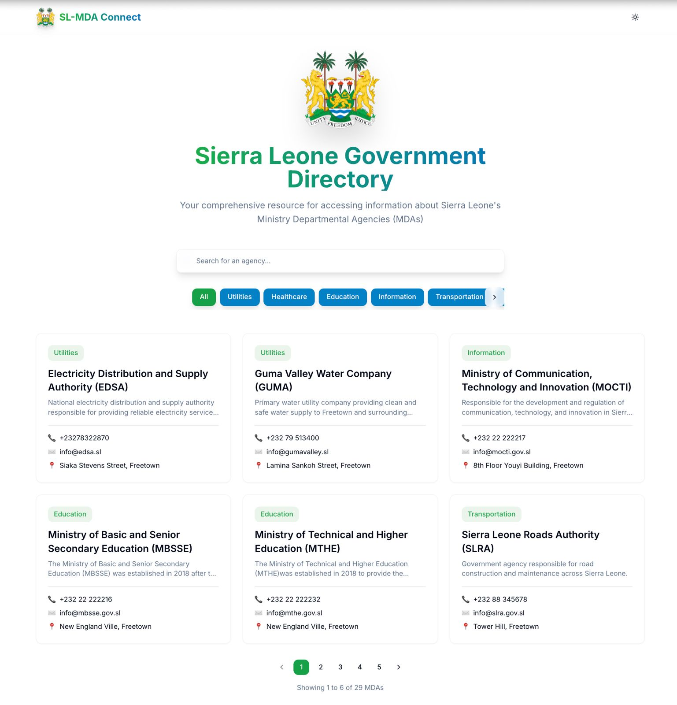
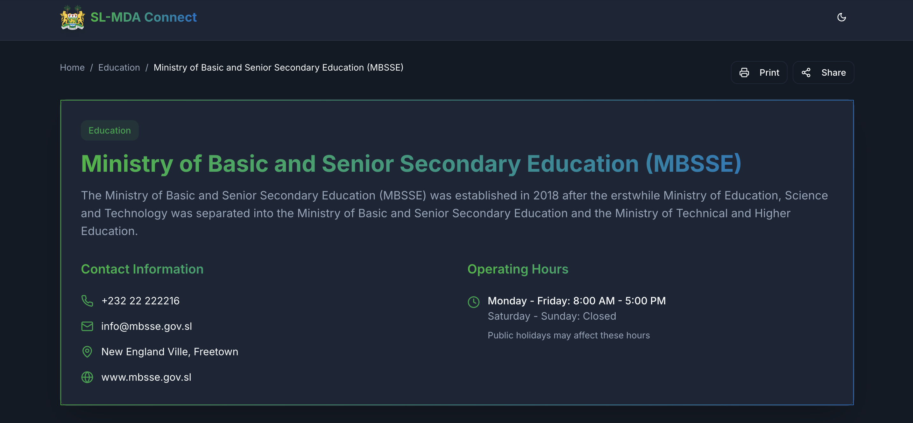
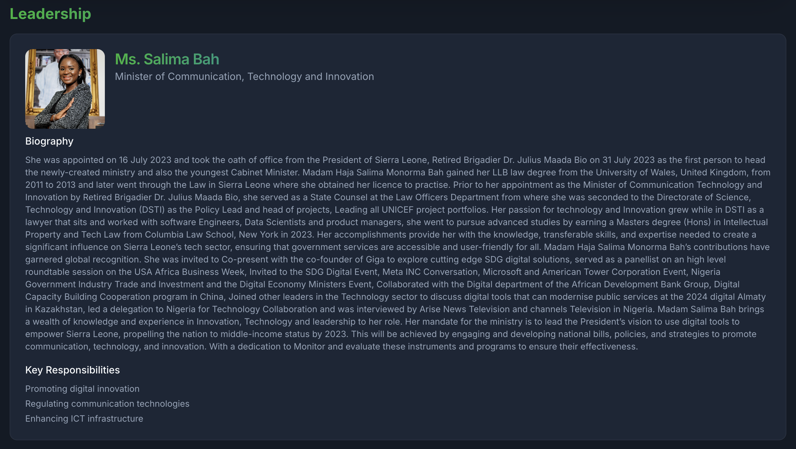
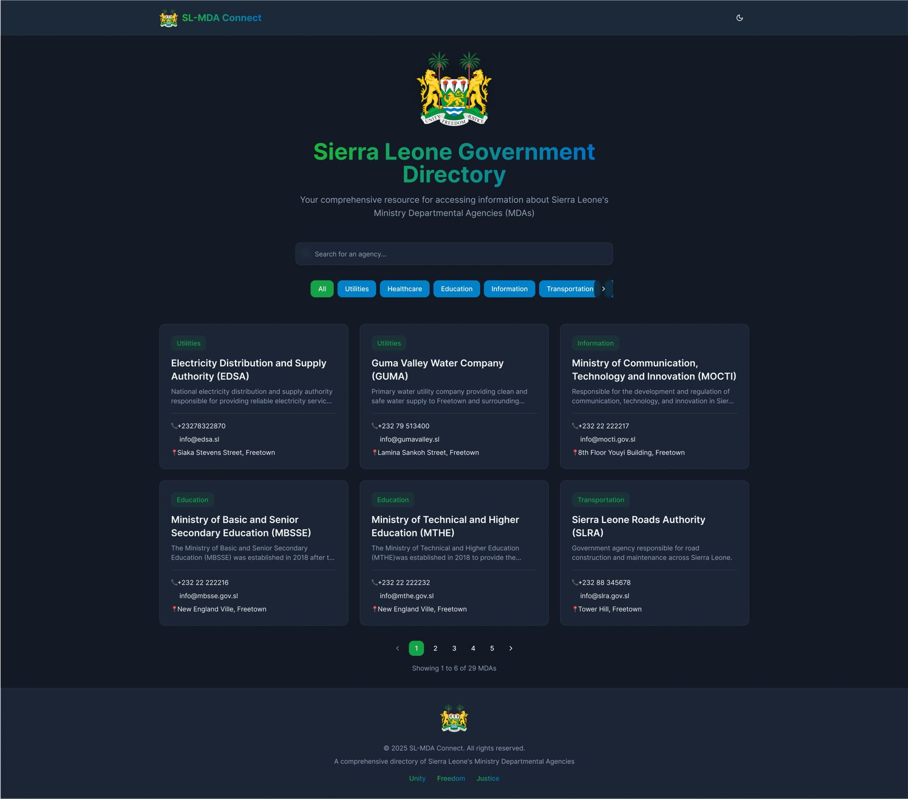
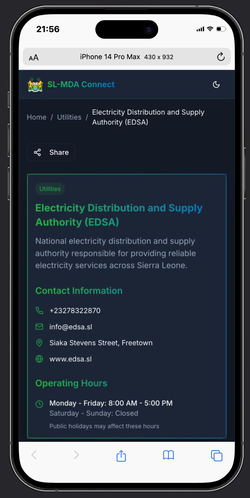
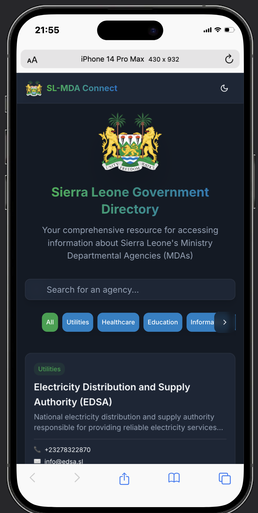

# SL-MDA Connect - Sierra Leone Government Directory


## Overview

SL-MDA Connect is a comprehensive directory web application that provides easy access to information about Sierra Leone's Ministry Departmental Agencies (MDAs). The platform offers a user-friendly interface to search, filter, and access detailed information about various government agencies.

## Features

- **Comprehensive Agency Directory**: Access detailed information about all Sierra Leone government agencies
- **Advanced Search & Filtering**: Search agencies by name or filter by category
- **Responsive Design**: Fully responsive interface that works on all devices
- **Dark/Light Mode**: Toggle between dark and light themes
- **Interactive Maps**: View agency locations on integrated maps
- **Leadership Information**: Access details about agency leadership
- **Contact Information**: Direct access to agency contact details, including:
  - Phone numbers
  - Email addresses
  - Physical locations
  - Official websites

## Technologies Used

- **Frontend Framework**: Next.js 14 (React)
- **Styling**: Tailwind CSS
- **Icons**: Lucide React
- **Maps Integration**: Google Maps API
- **State Management**: React Hooks
- **UI Components**: shadcn/ui
- **Typography**: Inter font from Google Fonts

## Getting Started

### Prerequisites

- Node.js (v18 or higher)
- npm or yarn
- Google Maps API key (for location features)

### Installation

1. Clone the repository:
```bash
git clone https://github.com/Emmanuel1255/sl-mdas-connect.git
cd sl-mdas-connect
```

2. Install dependencies:
```bash
npm install
# or
yarn install
```

3. Run the development server:
```bash
npm run dev
# or
yarn dev
```

4. Open [http://localhost:3000](http://localhost:3000) in your browser.

## Project Structure

```
sl-mda-connect/
├── app/
│   ├── components/
│   ├── layout.tsx
│   └── page.tsx
├── public/
├── styles/
│   └── globals.css
├── lib/
│   └── mdaData.ts
└── types/
```

## Key Components

- `HomePage`: Main directory listing with search and filter functionality
- `AgencyPage`: Detailed agency information display
- `ScrollableCategories`: Horizontal scrollable category filter
- `LeadershipCard`: Agency leadership information display

## Styling

The project uses a combination of:
- Tailwind CSS for utility-first styling
- Custom CSS variables for theming
- Glass effect components
- Gradient text and borders
- Responsive design principles

## Contributing

1. Fork the repository
2. Create your feature branch (`git checkout -b feature/AmazingFeature`)
3. Commit your changes (`git commit -m 'Add some AmazingFeature'`)
4. Push to the branch (`git push origin feature/AmazingFeature`)
5. Open a Pull Request

## License

This project is licensed under the MIT License - see the [LICENSE.md](LICENSE.md) file for details.

## Contact

Emmanuel Kamanda - emmanuelkamanda1255@gmail.com
Project Link: [https://github.com/Emmanuel1255/sl-mdas-connect](https://github.com/Emmanuel1255/sl-mdas-connect)

## Acknowledgments

- [Next.js Documentation](https://nextjs.org/docs)
- [Tailwind CSS](https://tailwindcss.com)
- [shadcn/ui](https://ui.shadcn.com)
- [Lucide Icons](https://lucide.dev)
- Sierra Leone Government for agency information

## Screenshots

### Home Page

*Main directory page with search and category filtering*

### Agency Details

*Detailed view of a government agency with contact information and location*

### Leadership Section

*Agency leadership profiles and information*

### Dark Mode

*Dark theme interface for better visibility in low-light conditions*

### Mobile View
<div align="center">
  
  
</div>
*Responsive design on mobile devices*


## Deployment

The application is deployed on Vercel and can be accessed at https://sl-mdas-connect.vercel.app/.


